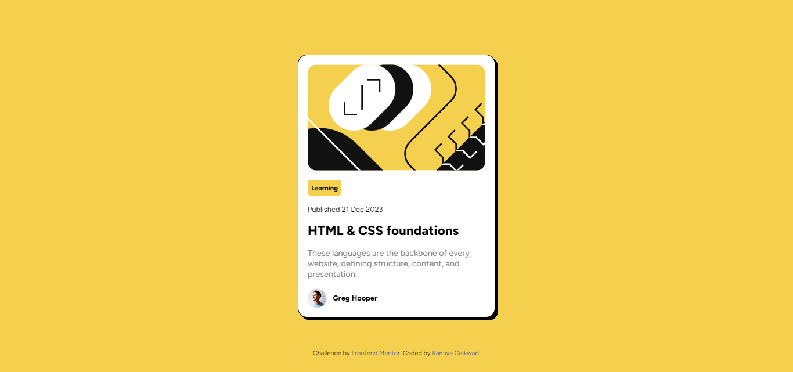

# Frontend Mentor - Blog preview card solution

This is a solution to the [Blog preview card challenge on Frontend Mentor](https://www.frontendmentor.io/challenges/blog-preview-card-ckPaj01IcS). Frontend Mentor challenges help you improve your coding skills by building realistic projects. 

## Table of contents

- [Overview](#overview)
  - [The challenge](#the-challenge)
  - [Screenshot](#screenshot)
  - [Links](#links)
- [My process](#my-process)
  - [Built with](#built-with)
  - [What I learned](#what-i-learned)
  - [Useful resources](#useful-resources)
- [Author](#author)

## Overview

### The challenge

Users should be able to:

- See hover and focus states for all interactive elements on the page

### Screenshot



### Links

- Solution URL: [Github](https://github.com/KamiyaGaikwad/Frontend-Mentor-Challenges/tree/main/blog-preview-card-main)
- Live Site URL: [Netlify](https://frontend-blog-preview-card-challenge.netlify.app/)

## My process

### Built with

- Semantic HTML5 markup
- CSS custom properties
- Flexbox
- Mobile-first workflow

### What I learned

1. I learnt to add custom font "Figtree" using "@font-face".

```css
@font-face {
    font-family: 'Figtree';
    src: url('./assets/fonts/static/Figtree-SemiBold.ttf');
    font-weight: 600;
    font-style: normal;
}
```
2. How to add box shadow.

```css
main{
    box-shadow: 0.3125rem 0.3125rem;
}
```

3. I also learnt how to change box shadow of parent element by hovering on child element.

```css
main{
    pointer-events: none;
}

main h1{
    pointer-events: auto;
}

main:hover{
    box-shadow: 0.625rem 0.625rem;
}
```

### Useful resources

- [Scalable](https://www.scalablecss.com/setup-custom-fonts-with-font-face/) - This helped me to add custom font Figtree in css.

- [W3school](https://www.w3schools.com/css/css3_shadows_box.asp) - This helped me in understanding box shadow.

- [Stackoverflow](https://stackoverflow.com/questions/8114657/how-to-style-the-parent-element-when-hovering-a-child-element) - This helped me to understand how to change css of parent element using child element.

## Author

- Website - [Kamiya Gaikwad](https://www.your-site.com)
- Frontend Mentor - [@KamiyaGaikwad](https://www.frontendmentor.io/profile/KamiyaGaikwad)
- Twitter - [@Kamiya_Gaikwad](https://www.twitter.com/Kamiya_Gaikwad)

