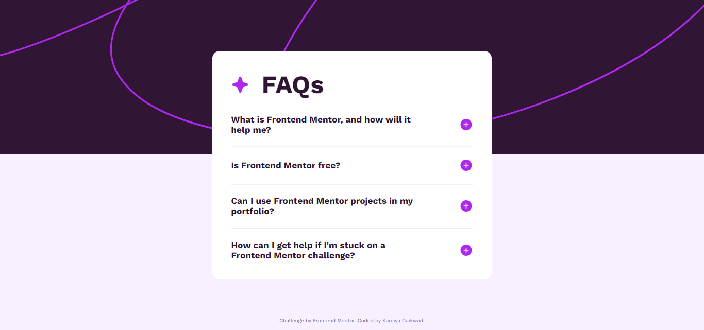

# Frontend Mentor - FAQ accordion solution

This is a solution to the [FAQ accordion challenge on Frontend Mentor](https://www.frontendmentor.io/challenges/faq-accordion-wyfFdeBwBz). Frontend Mentor challenges help you improve your coding skills by building realistic projects. 

## Table of contents

- [Overview](#overview)
  - [The challenge](#the-challenge)
  - [Screenshot](#screenshot)
  - [Links](#links)
- [My process](#my-process)
  - [Built with](#built-with)
  - [What I learned](#what-i-learned)
  - [Useful resources](#useful-resources)
- [Author](#author)

## Overview

### The challenge

Users should be able to:

- Hide/Show the answer to a question when the question is clicked
- Navigate the questions and hide/show answers using keyboard navigation alone
- View the optimal layout for the interface depending on their device's screen size
- See hover and focus states for all interactive elements on the page

### Screenshot



### Links

- Solution URL: [Github](https://github.com/KamiyaGaikwad/Frontend-Mentor-Challenges/tree/main/faq-accordion-main)
- Live Site URL: [Netlify](https://frontend-faq-accordion-main-challenge.netlify.app/)

## My process

### Built with

- Semantic HTML5 markup
- CSS custom properties
- Flexbox
- Mobile-first workflow
- Vanilla Javascript

### What I learned

I learnt how to adjust background perfectly on the element by using background size property.

To see how you can add code snippets, see below:

```css
body {
  background:url(./assets/images/background-pattern-desktop.svg);
  background-repeat: no-repeat;
  background-size: 100%;
}
```

### Useful resources

- [w3schools](https://www.w3schools.com/cssref/css3_pr_background-size.php) - This helped me implement background size property.

## Author

- Website - [Kamiya Gaikwad](https://www.your-site.com)
- Frontend Mentor - [@KamiyaGaikwad](https://www.frontendmentor.io/profile/KamiyaGaikwad)
- Twitter - [@Kamiya_Gaikwad](https://www.twitter.com/Kamiya_Gaikwad)
