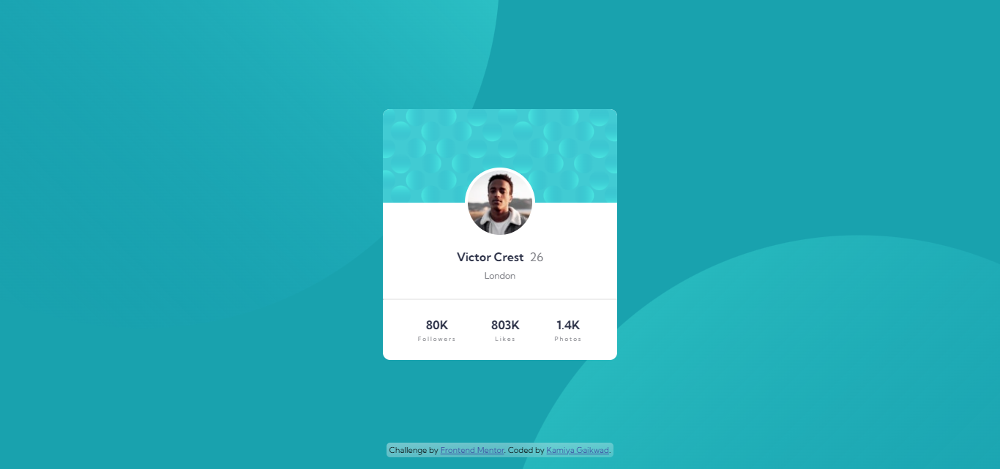

# Frontend Mentor - Profile card component solution

This is a solution to the [Profile card component challenge on Frontend Mentor](https://www.frontendmentor.io/challenges/profile-card-component-cfArpWshJ). Frontend Mentor challenges help you improve your coding skills by building realistic projects. 

## Table of contents

- [Overview](#overview)
  - [The challenge](#the-challenge)
  - [Screenshot](#screenshot)
  - [Links](#links)
- [My process](#my-process)
  - [Built with](#built-with)
  - [What I learned](#what-i-learned)
  - [Useful resources](#useful-resources)
- [Author](#author)

## Overview

### The challenge

- Build out the project to the designs provided

### Screenshot



### Links

- Solution URL: [Github](https://github.com/KamiyaGaikwad/Frontend-Mentor-Challenges/tree/main/profile-card-component-main)
- Live Site URL: [Netlify](https://frontend-profile-card-challenge.netlify.app/)

## My process

### Built with

- Semantic HTML5 markup
- CSS custom properties
- Flexbox

### What I learned

I learned to create a glass background using linear gradient and backdrop-filter to display attribution.

To see how you can add code snippets, see below:

```css
background: linear-gradient(
        to right bottom,
        rgba(255, 255, 255, 0.4),
        rgba(255, 255, 255, 0.2)
    );
backdrop-filter: blur(1rem);
```


### Useful resources

- [Dev](https://dev.to/chinmaymhatre/create-a-glass-ui-using-only-two-css-properties-3k9h) - This helped me to create the glass background.

## Author

- Website - [Kamiya Gaikwad](https://kamiya-gaikwad-portfolio.vercel.app/)
- Frontend Mentor - [@KamiyaGaikwad](https://www.frontendmentor.io/profile/KamiyaGaikwad)
- Twitter - [@Kamiya_Gaikwad](https://www.twitter.com/Kamiya_Gaikwad)

