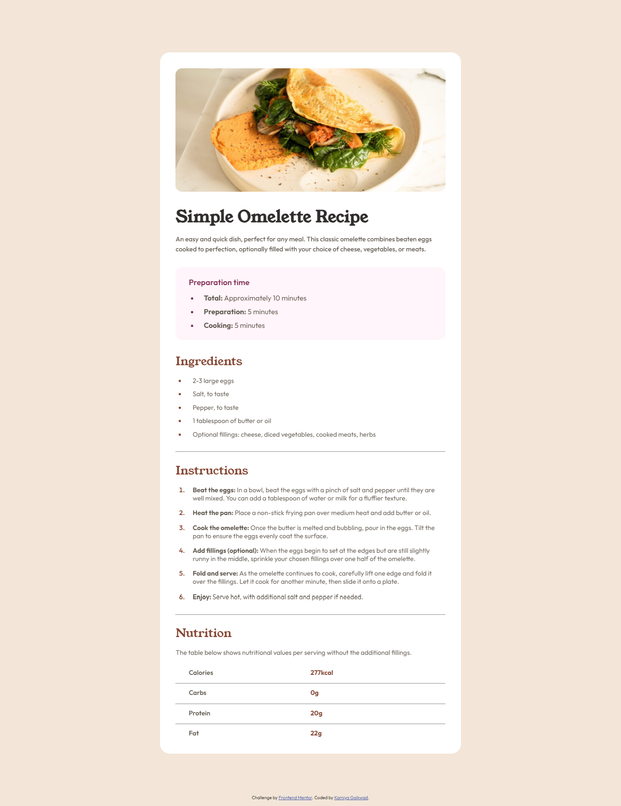

# Frontend Mentor - Recipe page solution

This is a solution to the [Recipe page challenge on Frontend Mentor](https://www.frontendmentor.io/challenges/recipe-page-KiTsR8QQKm). Frontend Mentor challenges help you improve your coding skills by building realistic projects. 

## Table of contents

- [Overview](#overview)
  - [The challenge](#the-challenge)
  - [Screenshot](#screenshot)
  - [Links](#links)
- [My process](#my-process)
  - [Built with](#built-with)
  - [What I learned](#what-i-learned)
  - [Useful resources](#useful-resources)
- [Author](#author)

## Overview

### Screenshot



### Links

- Solution URL: [Github](https://github.com/KamiyaGaikwad/Frontend-Mentor-Challenges/tree/main/recipe-page-main)
- Live Site URL: [Netlify](https://frontend-recipe-page-main-challenge.netlify.app/)

## My process

### Built with

- Semantic HTML5 markup
- CSS custom properties
- Flexbox
- Mobile-first workflow

### What I learned

I learnt how to style markers in list using css.

To see how you can add code snippets, see below:

```css
.intructions ol li::marker{
    color:var(--nutmeg);
    font-weight: 600;
}
```

### Useful resources

- [w3schools](https://www.w3schools.com/howto/howto_css_bullet_color.asp) - This helped me to style markers in list.

## Author

- Website - [Kamiya Gaikwad](https://www.your-site.com)
- Frontend Mentor - [@KamiyaGaikwad](https://www.frontendmentor.io/profile/KamiyaGaikwad)
- Twitter - [@Kamiya_Gaikwad](https://www.twitter.com/Kamiya_Gaikwad)
